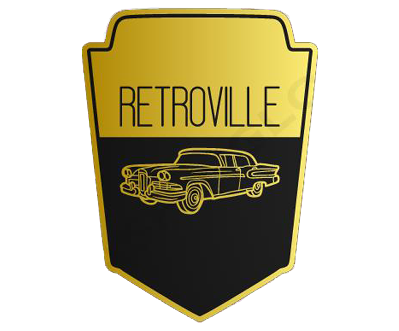

# 🚗 Retroville - E-commerce de Carros Clássicos

<div align="center">
  
  
  ### Plataforma de Curadoria e Venda de Veículos Clássicos
  
  [](https://opensource.org/licenses/MIT)
  [](https://php.net)
  [](https://www.mysql.com/)
  
  [🌐 Acesse o Site - (Fora do ar por utilizar hospedagem gratuita)](http://www.retroville.rf.gd) | [📧 Contato](mailto:retroville@gmail.com)
</div>

---

## 📖 Sobre o Projeto

**Retroville** é uma plataforma web desenvolvida como Trabalho de Conclusão de Curso (TCC) da ETEC Jornalista Roberto Marinho. O projeto oferece uma experiência completa de e-commerce especializado em veículos clássicos e antigos, conectando vendedores e entusiastas de automóveis históricos.

O sistema permite aos usuários navegar por uma seleção cuidadosamente curada de carros clássicos, visualizar especificações detalhadas, histórias dos veículos e realizar compras através de pagamento via PIX.

### 🎯 Objetivos

- Proporcionar uma experiência única para entusiastas de carros antigos
- Oferecer uma seleção de veículos clássicos autênticos
- Compartilhar a história e especificações técnicas de cada modelo
- Facilitar a compra segura através de sistema de pagamento integrado

---

## ✨ Funcionalidades

### Para Clientes
- 🔍 **Catálogo de Veículos**: Navegação por diferentes categorias (Sedans, Hatches, Coupês, Caminhonetes, SUVs, Conversíveis)
- 📱 **Interface Responsiva**: Design adaptado para desktop e dispositivos móveis
- 🔐 **Sistema de Login/Cadastro**: Autenticação segura de usuários
- 🛒 **Carrinho de Compras**: Adicione múltiplos veículos ao carrinho
- 💳 **Pagamento PIX**: Integração com sistema de pagamento instantâneo via QR Code
- 📄 **Detalhes do Produto**: Informações completas incluindo:
  - Especificações técnicas (motor, câmbio, ano, quilometragem)
  - Galeria de fotos (até 8 imagens por veículo)
  - História e contexto do modelo
  - Preço e disponibilidade
- 👤 **Perfil do Usuário**: Gerenciamento de dados pessoais e pedidos
- 📞 **Página de Contato**: Formulário para comunicação direta

### Para Administradores
- ➕ **Cadastro de Produtos**: Adicione novos veículos com informações detalhadas
- ✏️ **Edição de Produtos**: Atualize informações e imagens dos veículos
- 📋 **Lista de Produtos**: Visualize e gerencie todo o inventário
- 📦 **Gerenciamento de Pedidos**: Acompanhe vendas realizadas
- 🔒 **Painel Administrativo**: Área protegida para gestão completa

---

## 🛠️ Tecnologias Utilizadas

### Backend
- **PHP** - Linguagem principal do servidor
- **MySQL** - Banco de dados relacional
- **Composer** - Gerenciador de dependências PHP
- **mpdf/qrcode** - Geração de QR Codes para pagamento PIX

### Frontend
- **HTML5** - Estrutura das páginas
- **CSS3** - Estilização e design responsivo
- **JavaScript** - Interatividade e validações
- **Ion Icons** - Biblioteca de ícones
- **Vanilla Tilt.js** - Efeitos visuais 3D

### Integrações
- **PIX** - Sistema de pagamento instantâneo brasileiro

---

## 📦 Estrutura do Projeto

```
Retroville/
├── ADM/                      # Área administrativa
│   ├── _ADM/
│   │   └── script.sql       # Script de criação do banco
│   ├── controller/          # Controladores admin
│   ├── model/              # Modelos de dados admin
│   │   ├── Conexao.php     # Conexão com banco
│   │   ├── produtos.php    # Modelo de produtos
│   │   └── ferramentas.php # Funções auxiliares
│   └── view/               # Views administrativas
│       ├── css/            # Estilos da área admin
│       ├── home.php        # Dashboard
│       ├── listaProdutos.php
│       ├── produtos.php
│       └── listaPedidos.php
│
├── CLIENTE/                 # Área do cliente
│   ├── controller/         # Controladores cliente
│   ├── model/             # Modelos de dados cliente
│   │   ├── carrinhoModel.php
│   │   ├── pedidosModel.php
│   │   └── siginModel.php
│   └── view/              # Views do cliente
│       ├── css/           # Estilos da área cliente
│       ├── img/           # Imagens do site
│       ├── produtos.php   # Catálogo
│       ├── produto.php    # Detalhes do veículo
│       ├── carrinho.php   # Carrinho de compras
│       ├── logSigin.php   # Login/Cadastro
│       ├── sobre.php      # Sobre nós
│       └── contato.php    # Página de contato
│
├── app/                    # Classes da aplicação
│   └── Pix/               # Implementação PIX
│
├── vendor/                # Dependências do Composer
├── index.php             # Página inicial
├── pagamento.php         # Processamento de pagamentos
├── composer.json         # Configuração do Composer
└── README.md            # Este arquivo

```

---

## 🚀 Instalação e Configuração

### Pré-requisitos

- PHP 7.4 ou superior
- MySQL 8.0 ou superior
- Composer
- Servidor web (Apache/Nginx) ou PHP built-in server

### Passo a Passo

1. **Clone o repositório**
   ```bash
   git clone https://github.com/YBServilha/Retroville.git
   cd Retroville
   ```

2. **Instale as dependências**
   ```bash
   composer install
   ```

3. **Configure o banco de dados**
   
   Execute o script SQL para criar o banco e as tabelas:
   ```bash
   mysql -u seu_usuario -p < ADM/_ADM/script.sql
   ```
   
   Ou importe manualmente via phpMyAdmin/MySQL Workbench.

4. **Configure a conexão com o banco**
   
   Edite o arquivo `ADM/model/Conexao.php` com suas credenciais:
   ```php
   // Exemplo de configuração
   $host = "localhost";
   $dbname = "retroville";
   $user = "seu_usuario";
   $password = "sua_senha";
   ```

5. **Inicie o servidor**
   
   Usando PHP built-in server:
   ```bash
   php -S localhost:8000
   ```
   
   Ou configure no Apache/Nginx apontando para a pasta do projeto.

6. **Acesse a aplicação**
   
   Abra o navegador em: `http://localhost:8000`

---

## 🗄️ Estrutura do Banco de Dados

O banco de dados `retroville` contém as seguintes tabelas principais:

- **adm**: Credenciais dos administradores
- **produtos**: Catálogo completo de veículos
- **usuarios**: Dados dos clientes cadastrados
- **carrinho**: Itens no carrinho de cada usuário
- **pedidos**: Registro de vendas realizadas

### Credenciais Padrão

**Admin:**
- Email: `teste@gmail.com`
- Senha: `123` (codificada em base64)

> ⚠️ **Importante**: Altere as credenciais padrão em ambiente de produção!

---

## 💻 Como Usar

### Para Clientes

1. **Navegação**: Acesse a página inicial e explore as categorias de veículos
2. **Visualização**: Clique em um veículo para ver detalhes completos
3. **Cadastro**: Crie uma conta para realizar compras
4. **Compra**: Adicione veículos ao carrinho e finalize via PIX
5. **Acompanhamento**: Verifique seus pedidos no perfil

### Para Administradores

1. **Login**: Acesse `/ADM/index.php` com credenciais de admin
2. **Produtos**: Adicione, edite ou remova veículos do catálogo
3. **Pedidos**: Visualize e gerencie vendas realizadas
4. **Usuários**: Administre contas de clientes

---

## 👥 Equipe de Desenvolvimento

Projeto desenvolvido por alunos da **ETEC Jornalista Roberto Marinho**:

| Nome | Função | LinkedIn |
|------|--------|----------|
| **Yan Barbosa Servilha** | Lead & Desenvolvedor | [LinkedIn](https://www.linkedin.com/in/yan-barbosa-servilha) |
| **Brunno Silva** | Social Media | [LinkedIn](https://www.linkedin.com/in/brunno-steagall-770a951b0/) |
| **Danilo dos Santos** | Desenvolvedor | [LinkedIn](https://www.linkedin.com/in/danilo-almeida-7a0994269/) |
| **Enzo Lemos** | Designer/UX | [LinkedIn](https://www.linkedin.com/in/enzo-l-b9a881208/) |
| **Jorge Liotino** | Designer/UX | [LinkedIn](https://www.linkedin.com/in/jorge-liotino-2aa6b9267/) |
| **Rafael Henrique** | Redator | - |

---

## 🌐 Redes Sociais

Siga o Retroville nas redes sociais:

- 📸 [Instagram](https://www.instagram.com/retroville_rv/)
- 🎵 [TikTok](https://www.tiktok.com/@retroville_rv)

---

## 📝 Licença

Este projeto está sob a licença MIT. Consulte o arquivo [LICENSE](LICENSE) para mais detalhes.

```
MIT License

Copyright (c) 2023 DaniloMasterSantos

Permission is hereby granted, free of charge, to any person obtaining a copy
of this software and associated documentation files (the "Software")...
```

---

## 🤝 Contribuindo

Embora este seja um projeto acadêmico, sugestões e feedbacks são bem-vindos!

1. Fork o projeto
2. Crie uma branch para sua feature (`git checkout -b feature/MinhaFeature`)
3. Commit suas mudanças (`git commit -m 'Adiciona MinhaFeature'`)
4. Push para a branch (`git push origin feature/MinhaFeature`)
5. Abra um Pull Request

---

## 📞 Contato

Para dúvidas, sugestões ou parcerias:

- 🌐 **Site**: [www.retroville.rf.gd](http://www.retroville.rf.gd) (Fora do ar por utilizar hospedagem gratuita)
- 📧 **Email**: Entre em contato através do [formulário no site](http://www.retroville.rf.gd/CLIENTE/view/contato.php)

---

<div align="center">
  
  ### Feito com entusiasmo pela equipe Retroville
  
  **ETEC Jornalista Roberto Marinho - 2023**
  
</div>
